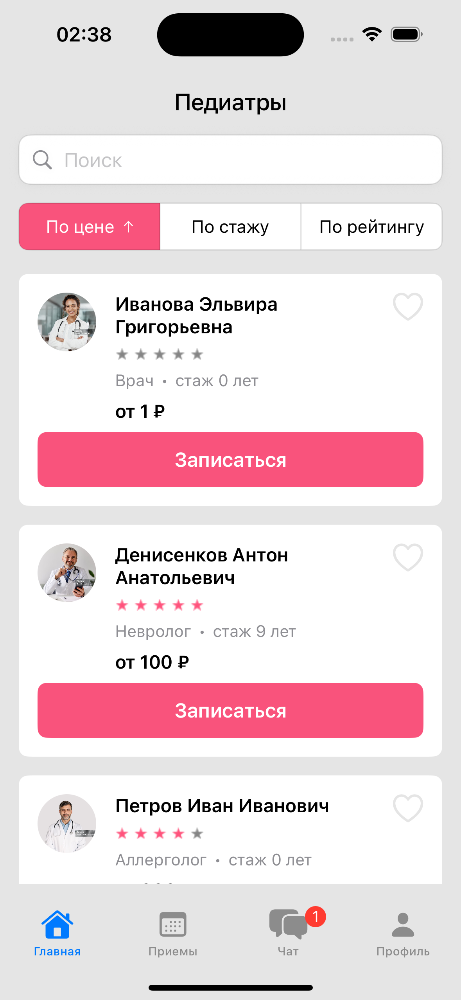
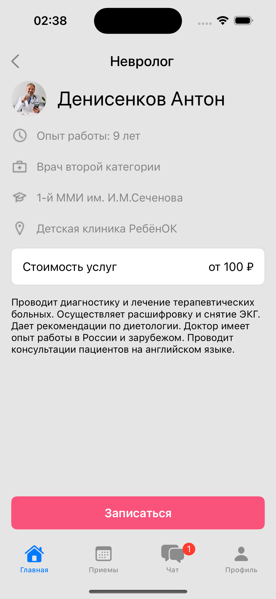
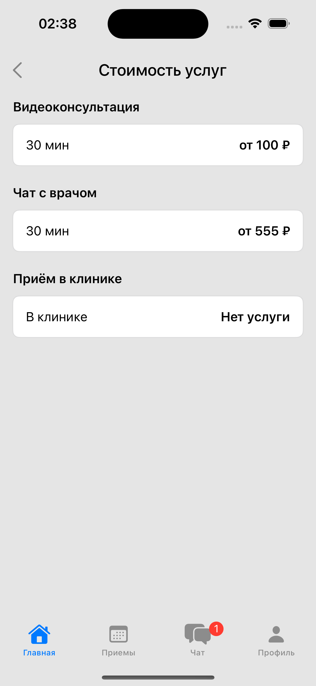

# Тестовое задание

Выполнено на языке Swift (iOS).

## 📷 Скриншоты

  
  
  

## 🚀 Установка

1. Клонируйте репозиторий:
   
git clone https://github.com/JLNap/testDoctors.git

2. Откройте проект в Xcode.

## ✨ Особенности

- Получение данных из JSON файла
- Сортировки карточек докторов
- SwiftUI MVVM

## 👤 Автор

Андрей Чучупал  
[Связаться](https://t.me/achuchupal)
